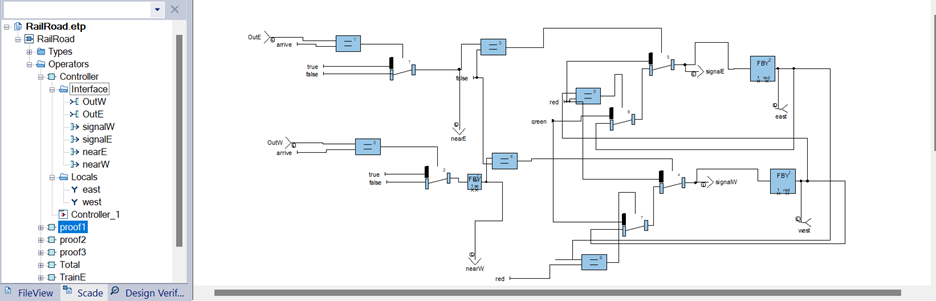
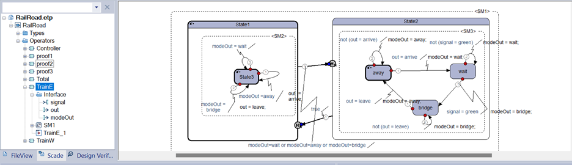
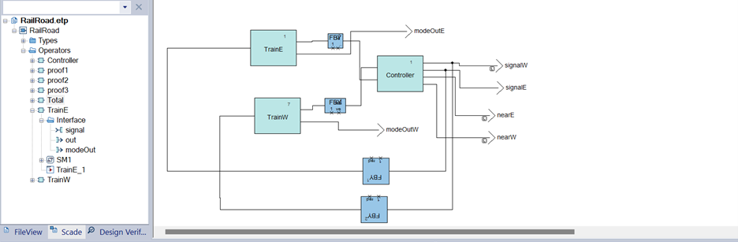
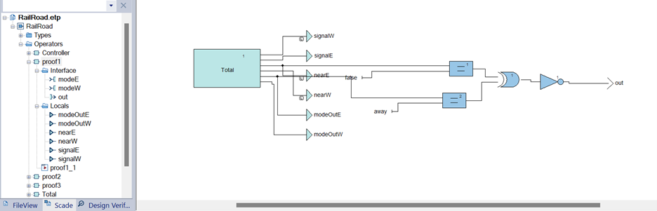
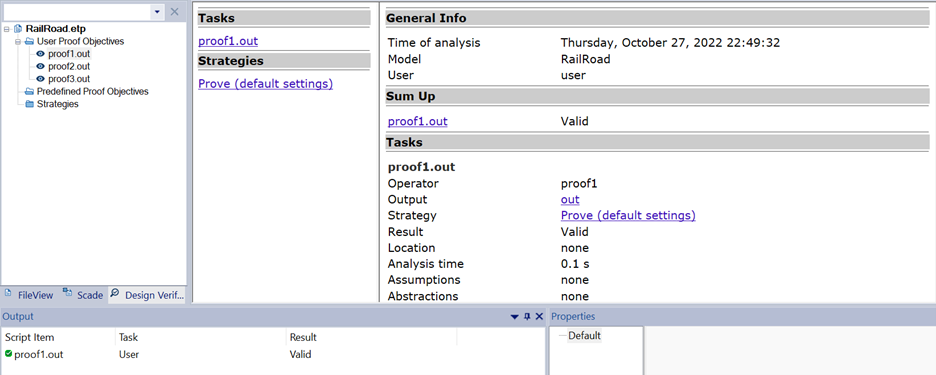
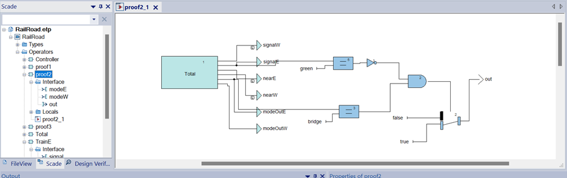
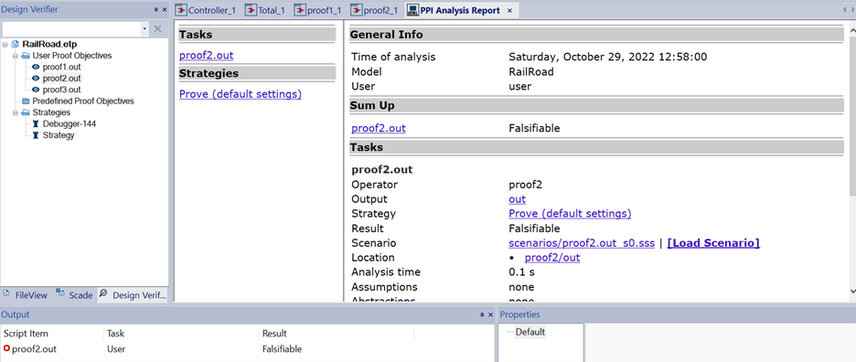
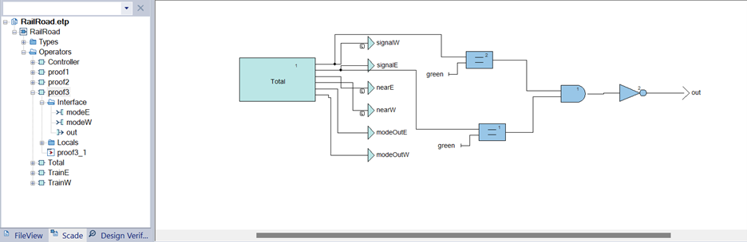
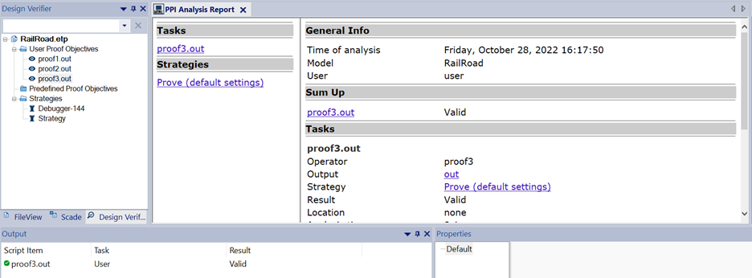

# Railroad Controller Implementation and Analysis using SCADE

In this project, I've implemented a railroad controller using SCADE due to "Principles of Cyber-Physical Systems" by Rajeev Alur and Gera Weiss, Exersice 3.9, focusing on preventing collisions between two trains at a bridge. The controller prioritizes the east train to maintain safety and manage signal control. I've divided the implementation into several operators for clarity and ease of integration.

## Operators Implemented

### Controller Operator

The controller operator is designed based on the approach depicted in Figure 3.8. This operator ensures priority for the east train by assessing whether the exit for the east train has occurred. If true, `nearE` is set to 1; otherwise, it remains 0. A similar approach is used to set `nearW` for the west train, favoring the east train.

By utilizing a delay of 1 and logical conditions, the controller operator manages the states of the east and west signals. If `nearE` is 0, signal E is red; otherwise, if the W signal is red, signal E turns green. Delays are incorporated to account for causal relationships.

  

### TrainW and TrainE Operators

These operators handle the train modes and produce the `out` output, which is used in the controller's signal outputs. To manage interactions between 1State and 2State modes, a weak transition is employed. Delays are utilized to ensure proper input/output synchronization.

  

### Total Operator

The total operator integrates the previous operators to form the final system. Signals from TrainE and TrainW operators are directed to the controller, enabling the control of green and red signals for the trains. FBY transitions are applied to address weak transitions and causal concerns.

  

## Verification and Proof

### Property: (nearE = 0) ↔ (modeE = away)

This property ensures that the east train's mode corresponds to its proximity status. The implementation uses a logical equivalence gate to validate this property. Debugging steps were conducted for all modes, resulting in no violations. Additionally, the property was proven inductively across three states, confirming its validity.

  

  

### Property: modeE = bridge → east = green

For this property, we verified that when the east train is on the bridge, the east signal is green. An example was constructed to demonstrate a potential violation, and debugging, induction, and formal proof were performed to validate the property's correctness.

  

  

### Property: ¬ (east = green ∧ west = green)

This property checks that both east and west signals are not green simultaneously. The implementation followed the provided specification, and verification steps confirmed its inductive nature. Debugging, induction, and formal proof were carried out to ensure the property holds.

  

  

## Conclusion

By implementing the railroad controller using SCADE and conducting thorough verification and proof steps, we have ensured the safety and correctness of the system. The integrated operators, logical conditions, and formal verification techniques guarantee that the trains can navigate the bridge without collisions, adhering to the specified safety requirements.
